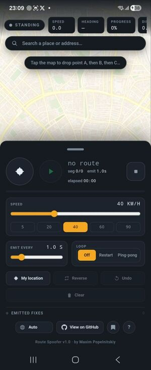
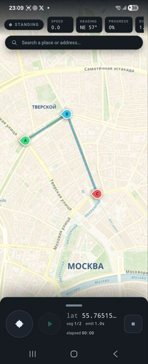
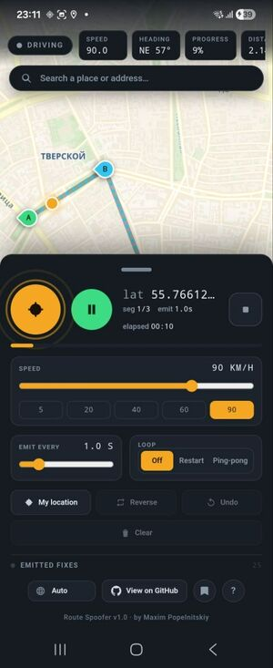
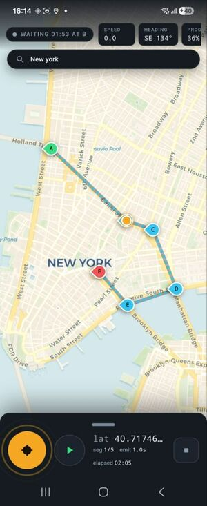
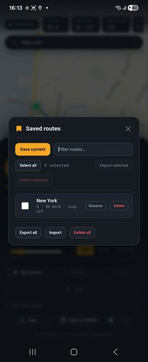
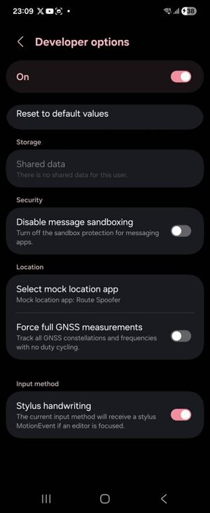
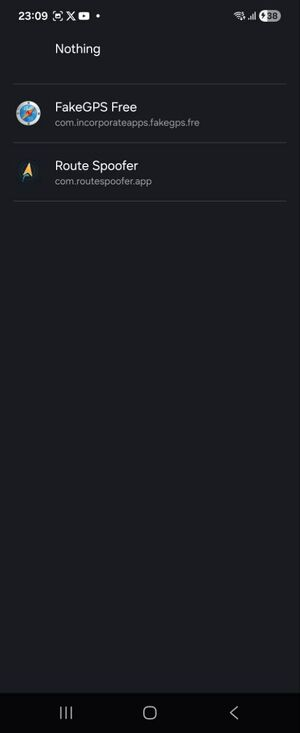

# Route Spoofer

[](LICENSE)
[](https://qaprovider.com/)

🌐 **Landing page:** <https://gegirhasut.github.io/route-spoofer/>

> 🧪 **Currently in closed testing on Google Play.** A public release is coming soon. Building from source is still possible for developers (see below).

**Android mock-GPS route player for testing location-based apps — broadcasts a
scripted, moving location to your whole device.** Any other app — maps,
navigation, driver, delivery or dispatch — reads the simulated position as real,
so you can test routes and reproduce trips without physically moving.

Android only: iOS has no public mock-location API.

## Screenshots

| | | |
|:---:|:---:|:---:|
|  |  |  |
| Empty start — tap the map | A route drawn (A → B → C) | Driving with live speed |
|  |  |  |
| Jump anywhere by place search | Waiting at a point (dwell) | Saved routes — import / export |

## Features

- **Broadcasting is separate from movement.** A **GPS toggle** turns location
  broadcasting on/off on its own; **GO / Pause** drives the cursor along the
  route. With GPS on and a single point, the driver just stands there and
  broadcasts that position.
- **Route building.** Tap the map to drop points (A, B, C…), drag to move them,
  and append new points to the end — even while driving. Any point is editable
  at any time; editing the route behind the driver keeps the current position
  continuous. A **Lock route** toggle blocks map taps and point drags so a stray
  tap can't add or move points by accident — tap again to unlock.
- **Per-point options** (long-press a point): **wait N minutes** (auto-resume),
  **wait until GO**, a **custom speed** for the leg ending at that point, and
  **remove**.
- **GO ends any wait early** — a timed wait, a wait-until-GO, or arrival — and
  resumes immediately.
- **End of route:** the driver stops and **keeps broadcasting** the final
  position; only the GPS toggle stops broadcasting. **Loop modes:** off /
  restart / ping-pong.
- **Speed:** a live global speed slider (changeable mid-drive) plus optional
  per-leg speed overrides.
- **Saved routes.** Save the whole scene as a named route, then load, rename or
  delete it — all on-device. Select several to export one JSON file (or share it
  from Android); import merges them back.
- **Place search.** Search any place or address to recenter the map anywhere on
  the globe; the app also remembers your last map view between launches.
- **Live status label:** _Standing_ / _Driving_ / _Waiting m:ss at a point_ /
  _Waiting for GO_ / _Arrived_.
- **In-app Help (“?”)** with a full legend, and an **8-language UI** (EN, RU, DE,
  ES, PT, FR, ZH, HI) with auto-detect and a manual switcher. Dark
  instrument-panel design.

## How it works

A **Capacitor** web UI (HTML/JS) handles the map, route editing and preview. A
native **Kotlin foreground service** owns the playback clock and injects the
current position into the Android **GPS and NETWORK test providers**, so the fix
reaches the whole system and keeps emitting while the app is backgrounded. The
movement math and the hold/wake state machine live in a pure, unit-tested
`RouteEngine`.

For this to work, Route Spoofer must be selected as the system **mock-location
app** in Android Developer options (see Phone setup).

## Known limitations

Route Spoofer mocks the system location provider (and the Fused Location Provider
on Google Play devices), so it works with apps that rely on system location —
verified with Google Maps and maps.me. Some apps run their own network-based
positioning on top of the system location (Yandex Maps is one observed example)
and can override the mock with the device's real position. **Workaround:** disable
Wi-Fi and mobile data while spoofing.

## Phone setup

1. Enable **Developer options**: **Settings → About phone → Build number**,
   tapped seven times.
2. Allow installs from unknown sources and sideload the APK.
3. **Developer options → Select mock location app → Route Spoofer.**
4. Launch the app, grant the **Location** permission and **Notifications**, and
   wait for the readiness card.
5. Turn **GPS** on to start broadcasting; press **GO** to drive.

<p>
  
  &nbsp;
  
</p>

## Build

Two paths are supported — see [BUILD.md](BUILD.md) for full details.

- **Cloud (GitHub Actions).** Every push builds the app and runs the full
  quality gate; developers can grab the `app-debug.apk` artifact from a workflow
  run.
- **Local (Android Studio).** Open the project with **JDK 21** and the Android
  SDK installed, then build the debug APK.

Toolchain: Capacitor 7 / JDK 21, targeting Android 16 (API 36).

## Development

The native code is split into focused pieces:

- `RouteEngine` — pure movement math + hold/wake state machine (arc length,
  interpolation, bearing, dwell/GO, per-leg & live speed, loop modes,
  hold-at-end). No Android deps; unit tested on the JVM.
- `MockLocationInjector` — the GPS + NETWORK test-provider plumbing.
- `MockLocationService` — foreground-service lifecycle, notification and the
  playback clock; emits each fix to the web UI.
- `FakeGpsPlugin` — the Capacitor JS bridge.

CI runs the same quality gate **before** building the APK — Kotlin unit tests,
ktlint, detekt and ESLint:

```bash
# Kotlin unit tests (RouteEngine — runs on the JVM, no emulator)
cd android && ./gradlew test

# Format / check Kotlin (ktlint)
cd android && ./gradlew ktlintFormat
cd android && ./gradlew ktlintCheck

# Static analysis (detekt); legacy findings are grandfathered in
# android/app/config/detekt/baseline.xml — new issues fail the build
cd android && ./gradlew detekt

# Lint the web UI (ESLint + eslint-plugin-html, lints the inline JS in www/)
npm run lint
npm run lint:fix   # safe auto-fixes only
```

## Localization

The UI and the service notification ship in **8 languages**:

- English (source / fallback)
- Русский (Russian)
- Deutsch (German)
- Español (Spanish)
- Português (Brazilian Portuguese)
- Français (French)
- 中文 (Simplified Chinese)
- हिन्दी (Hindi)

The language auto-detects from the system locale on first launch and can be
changed any time from the **Language** selector (choose **Auto** to follow the
system again). English is the source of truth and the fallback for any missing
string. **Chinese and Hindi are machine-drafted, pending native review** —
corrections are welcome.

## Platform support

**Android only.** iOS is not supported, as it has no public mock-location API.

## Testing & QA

Beta-tested via **[QAProvider](https://qaprovider.com/)** — independent QA for
location-based Android apps.

## License

MIT — © 2026 Maxim Popelnitskiy. See [LICENSE](LICENSE).

## Author

Maxim Popelnitskiy &nbsp;·&nbsp; QA: **[QAProvider](https://qaprovider.com/)**
